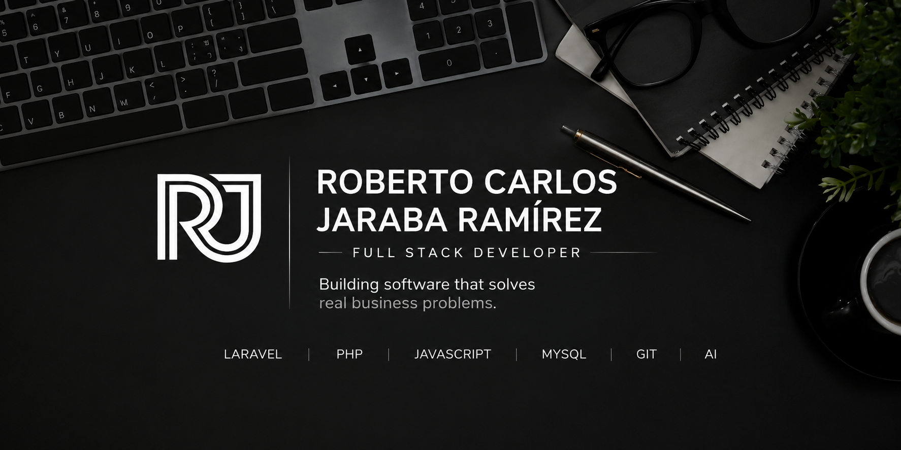

  

<h1 align="center">Hola, soy Roberto Carlos Jaraba Ramírez 👋</h1>

<h3 align="center">
Full Stack Developer • Entrepreneur • Problem Solver
</h3>

Construyendo software que resuelve problemas reales de negocio.

  

  

Después de casi una década trabajando con empresas, diseño gráfico, procesos de producción y gestión de negocios, decidí llevar esa experiencia al desarrollo de software.

Hoy estoy enfocado en crear aplicaciones web escalables, con interfaces modernas y una arquitectura limpia, siempre pensando primero en el problema que necesita resolver el cliente.

Actualmente desarrollo **Estelar ERP**, un sistema que nació para resolver las necesidades reales de mi propia empresa y que continúa evolucionando como una plataforma completa de gestión empresarial.

---

## 🚀 Actualmente

- 💻 Desarrollando **Estelar ERP**
- 📚 Aprendiendo Inteligencia Artificial aplicada al desarrollo
- ⚡ Mejorando mis habilidades como Full Stack Developer
- 🎯 Buscando oportunidades para desarrollar software que genere impacto

---

## 💡 Mi filosofía

> *La tecnología solo tiene valor cuando resuelve problemas reales.*

Antes de escribir una línea de código me pregunto:

**¿Qué problema estamos solucionando?**

Después pienso en la experiencia del usuario.

Y finalmente en construir una arquitectura limpia, mantenible y escalable.

---

## 🛠 Tecnologías

Laravel • PHP • JavaScript • HTML • CSS • MySQL • Git

Actualmente sigo aprendiendo nuevas tecnologías y herramientas de IA para potenciar mi desarrollo.

---

## 🌎 Un poco sobre mí

📍 Sincelejo, Colombia

🎓 Ingeniero de Sistemas (Proceso de grado)

🚀 Fundador de mi propia empresa

❤️ Me apasiona crear productos que las personas realmente utilicen.

---

## 📫 Contacto

Próximamente...
